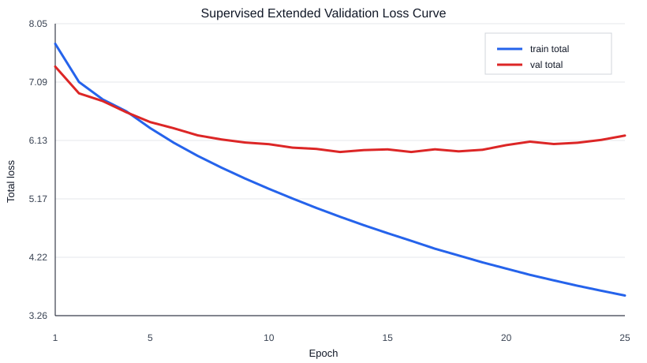

# McChess

A compact neural chess research system trained without Stockfish, Syzygy, or external engine labels.

## Project Goal

McChess studies how far a small neural chess agent can go using:

- human PGN supervised learning
- board tensor encoding
- legal move masking
- policy/value neural networks
- Monte Carlo Tree Search
- temporal modeling
- attention mechanisms
- optional search distillation
- optional self-play

The goal is not to beat modern engines. The goal is to build a clean, reproducible research platform for neural chess search under limited compute.

## Core Research Question

How far can a compact neural chess engine go using only human games, architectural inductive biases, search, and self-play without engine supervision?

## What This Project Demonstrates

- deep learning fundamentals
- chess board representation
- move-indexing design
- legal move masking
- policy/value modeling
- MCTS
- sequence modeling
- attention mechanisms
- ablation studies
- reproducible evaluation
- careful research engineering

## Non-Goals

This project does not use:

- Stockfish labels
- Leela labels
- Syzygy tablebases
- external engine evaluations
- pretrained engine recommendations

This project does not claim high Elo unless measured with a credible protocol.

## Planned System

```text
PGN games
  -> dataset builder
  -> board tensors, policy targets, value targets
  -> policy/value model
  -> policy-only bot
  -> MCTS-enhanced bot
  -> arena evaluation
```

## Planned Model Families

- ResNet
- History ResNet
- ResNet + square attention
- LSTM history
- LSTM + temporal attention
- Temporal Transformer

## Planned Baselines

- random legal-move bot
- material-count bot
- shallow minimax bot
- policy-only neural bot
- policy/value + MCTS bot

## Development Philosophy

Build one milestone at a time.

Prioritize:

- correctness
- tests
- reproducibility
- honest evaluation
- small reviewable changes

Avoid:

- overbuilding early
- hidden engine supervision
- unsupported Elo claims
- giant untested code dumps

The project coding standard is documented in `docs/CODING_STANDARD.md`. In
short: keep the code compact and hackable, make chess/tensor contracts explicit,
prefer simple functions plus dataclasses, use Poetry and reproducible YAML
configs, and test every public chess or model-shape contract.

## Setup

This project uses Poetry with Python 3.11+.

Recommended local setup:

```bash
poetry env use python3.12
poetry install --with dev,notebook
```

This repository includes `poetry.toml`, so Poetry creates the virtual environment at `.venv/`.

If Poetry complains that the current Python is `3.9.x`, deactivate Conda first:

```bash
conda deactivate
poetry env use python3.12
poetry install --with dev,notebook
```

Verify the interpreter:

```bash
poetry run python --version
```

Run checks through Poetry:

```bash
poetry run pytest
poetry run ruff check .
poetry run mypy src
```

GitHub Actions CI runs `poetry check`, `pytest`, `ruff`, and `mypy` on push and pull request.

Start notebooks through Poetry:

```bash
poetry run jupyter nbclassic
```

Current smoke notebooks:

- `notebooks/encoding_smoke_test.ipynb`
- `notebooks/move_indexing_smoke_test.ipynb`
- `notebooks/dataset_builder_smoke_test.ipynb`

## Research Discipline

The project keeps technical contracts and reproducibility rules in:

- `INVARIANTS.md`
- `REPRODUCIBILITY.md`
- `docs/DATASET_PROTOCOL.md`
- `docs/EVALUATION_PROTOCOL.md`
- `EXPERIMENTS.md`

Reportable results should include configs, seeds, manifests, checkpoints, metrics, and evaluation metadata. Weak, failed, and inconclusive runs should be documented when they answer a research question or expose a limitation.

## Early Smoke Reports

Development-only reports live in `reports/`. The first extended validation run
shows that the current model, loader, loss, metrics, checkpoint, and plot path
work end to end on the full local 1,000-game (ver small) Lichess sample, with validation
loss improving before mild late overfitting. This run is very far from an actual training run. 



- `reports/2026-06-01-tiny-loss-smoke.md`
- train total loss: `7.7169 -> 3.5878` over 25 local epochs
- validation total loss: `7.3424 -> 5.9418` at best epoch 13
- final validation total loss: `6.2109` at epoch 25
- runtime: `357.7s` total on MPS

This is not a strength result and is not a reportable experiment.

## Current Status

Repository foundation, board encoding, move indexing, legal policy masking, and the PGN dataset builder are in place.
