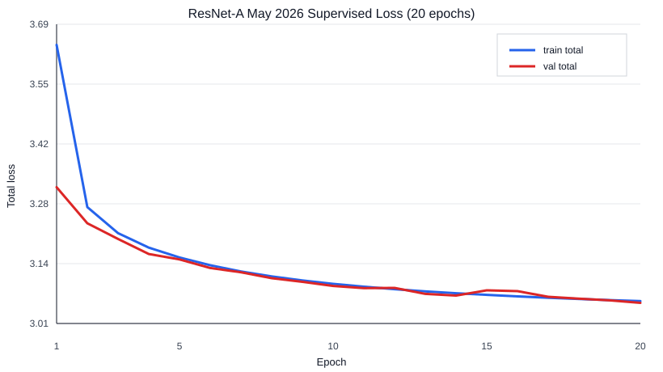
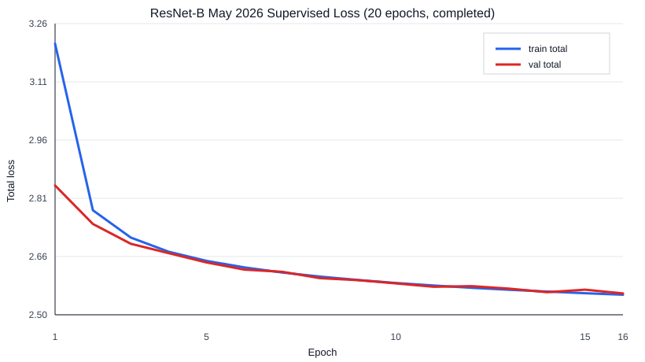

# McChess

[](https://github.com/MecGlandorff/McChess/actions/workflows/ci.yml)
[](LICENSE)

> **Current local rating estimate: 2489 Elo (rough 95% interval: 2415-2566).**
>
> **This is not an official FIDE rating.** It is a local benchmark estimate for
> the ResNet-C epoch-22 checkpoint using MCTS-1000 with inference batch size 8.
> McChess scored 84.75% over 200 included games against Stockfish 18 `UCI_Elo`
> levels 1600-2500 at 1.0 second per Stockfish move. It is not Lichess Elo or a
> general engine-strength rating. See the
> [benchmark report](reports/2026-07-16-stockfish-mcts1000-resnet-c-epoch22-200games.md),
> [config](configs/eval/stockfish_mcts1000_resnet_c_epoch22_batch8_elo_200games.yaml),
> and [evaluation protocol](docs/EVALUATION_PROTOCOL.md).

| Stockfish setting | McChess W/D/L | Score |
|---|---:|---:|
| Full strength, sanity only | 0/0/2 | 0.0% |
| `UCI_Elo` 1600 | 20/0/0 | 100.0% |
| `UCI_Elo` 1700 | 19/0/1 | 95.0% |
| `UCI_Elo` 1800 | 17/1/2 | 87.5% |
| `UCI_Elo` 1900 | 19/1/0 | 97.5% |
| `UCI_Elo` 2000 | 17/3/0 | 92.5% |
| `UCI_Elo` 2100 | 14/4/2 | 80.0% |
| `UCI_Elo` 2200 | 16/3/1 | 87.5% |
| `UCI_Elo` 2300 | 15/3/2 | 82.5% |
| `UCI_Elo` 2400 | 10/8/2 | 70.0% |
| `UCI_Elo` 2500 | 6/10/4 | 55.0% |
| **Rated total** | **153/33/14** | **84.75%** |

## Quick Start: Watch Or Play Search

The repository includes a compact inference-only epoch-30 ResNet-C model. After
installing dependencies, play it directly from a terminal:

```powershell
poetry install
poetry run mcchess-play
```

The supported default is fixed-budget MCTS-800. Use
`poetry run mcchess-play --mode policy` for faster policy-only play, or
`poetry run mcchess-play --help` for color, device, checkpoint, and search
options. The artifact and its checksum, provenance, and limitations are under
[`models_archive/`](models_archive/README.md).

The play notebooks remain optional visual interfaces. Open
[notebooks/play_mcts_bot.ipynb](notebooks/play_mcts_bot.ipynb) for MCTS-800 or
[notebooks/play_policy_bot.ipynb](notebooks/play_policy_bot.ipynb) for
policy-only play against the same bundled model.

For the search math, see
[MCTS And PUCT In McChess](reports/2026-06-17-mcts-puct-explainer.md). The
report explains the PUCT score, legal masked priors, and the value backup sign
flip with diagrams.

McChess is a compact neural-chess research system: raw human PGNs in, explicit
chess-rule tensors out, PyTorch policy/value checkpoints, reproducible metrics,
and playable policy-only plus fixed-budget MCTS bots. It is built around one
question:

> How far can a small neural chess agent go using human games, architectural
> inductive bias, search, and self-play without engine supervision?

Training supervision excludes Stockfish or Leela moves and evaluations,
tablebase labels, external best-move labels, and imported engine weights.
Syzygy tablebases are not used. Stockfish is permitted only as an external
evaluation opponent. `python-chess` owns the rules. Neural networks rank and
evaluate positions only after legal move masking.

For a quick inspection path through the repo, see [REVIEWER.md](REVIEWER.md).

McChess is not a claim of engine strength. It is a research platform for clean
ablations, evaluation, and compact neural search under limited compute (in my case a Nvidia RTX4060 (8GB VRAM)+ 16GB of RAM).

## What Works Now

McChess already has the core supervised-learning stack needed for neural chess
experiments:

| Area | Current capability |
|---|---|
| Chess contracts | 18-plane `[18, 8, 8]` board tensors, side-to-move values, and a fixed 4,672-action policy space |
| Legality | Explicit legal move masks from `python-chess`; the model is never trusted to learn legality |
| Data | PGN streaming, corrupt/unknown-result accounting, game-level splits, JSONL shards, and manifests |
| Training input | JSONL-backed datasets plus optional tensor caches for faster local CUDA training |
| Models | PyTorch policy/value ResNet presets: `resnet_a`, `resnet_b`, and BatchNorm `resnet_c` |
| Training | YAML-configured supervised training with epoch metrics, batch metrics, checkpoints, and loss plots |
| Evaluation metrics | Legal-masked supervised top-k evaluation and value diagnostics via `python -m mcchess.eval.supervised` |
| Search | Deterministic fixed-budget PUCT MCTS with masked policy priors and value backup sign flips |
| Bots | Random, material, negamax alpha-beta, policy-only checkpoint, and MCTS checkpoint bots |
| Play | Terminal play against the bundled epoch-30 model with an MCTS-800 default, plus optional policy-only and notebook interfaces |
| Reproducibility | Project invariants, dataset protocol, evaluation protocol, model card, configs, and CI checks |
| Tests | Coverage for board encoding, move indexing, legal masks, PGNs, datasets, model shapes, losses, checkpoints, bots, and scripts |

Not yet implemented:

- temporal and attention model families
- search distillation
- self-play

## Current Evidence

This section separates reportable supervised-learning measurements from local
development smoke results. None of these imply Elo, Lichess strength, or engine
competitiveness.

### Reported Baseline

The first reportable supervised baseline in `RESULTS.md` trained a compact
ResNet on a 600k-position prefix of Lichess 2013-01 and evaluated a 40k-position
held-out test slice:

| Experiment | Model | Legal top-1 | Legal top-3 | Legal top-5 | Value MSE |
|---|---|---:|---:|---:|---:|
| `supervised_resnet32x2_lichess2013_01` | ResNet 32ch x2, ~1.2M params | 0.262 | 0.492 | 0.610 | 0.858 |

That run used human moves and final game results only. The raw unmasked argmax
was legal for 88.8% of evaluated positions, which is useful evidence that the
model learned board structure, but move selection still requires explicit legal
masking. Larger ResNets may increase the percentage of legal raw argmax moves,
but legal masking stays in place.

### Full-Data Supervised Runs

The current matched ResNet-A vs ResNet-B comparison uses the May 2026 2000+ (rating)
Lichess dataset with 73,553,382 train positions and 747,498 validation
positions. Both runs use batch size 2048, AdamW, learning rate `5e-4`, seed
`20260501`, CUDA, and the tensor cache.

| Run | Model | Params | Epochs | Validation total loss | Final validation policy loss | Status |
|---|---|---:|---:|---:|---:|---|
| ResNet-A | 32 channels, 1 block | ~0.63M | 20 of 20 | `3.3176 -> 3.0549` | `2.1960` | completed 2026-06-07 |
| ResNet-B | 64 channels, 6 blocks | ~1.06M | 20 of 20 | `2.8403 -> 2.5447` | `1.7047` | completed 2026-06-11 |

Under matched data, seed, and optimizer settings, ResNet-B's epoch-1 validation
total loss (`2.8403`) was already below ResNet-A's final epoch-20 loss
(`3.0549`). The final ResNet-B validation total loss was `2.5447`.





`resnet_c` is implemented as a larger BatchNorm preset. The final epoch-30
inference artifact is bundled under `models_archive/`; its epoch-22 checkpoint
has the completed external MCTS benchmark documented below.

An initial local MCTS smoke result is documented in
[reports/2026-06-17-mcts-puct-explainer.md](reports/2026-06-17-mcts-puct-explainer.md).
Under `configs/eval/arena_resnet_b_policy_vs_mcts_50.yaml`, the ResNet-B
MCTS-50 bot scored 20 wins out of 20 games against the same ResNet-B checkpoint
used policy-only. Illegal moves were zero. This is a local fixed-config smoke
result, not an Elo estimate or a broad strength claim.

The current package-run external Stockfish-UCI benchmark is documented in the
[ResNet-C epoch-22 MCTS-1000 report](reports/2026-07-16-stockfish-mcts1000-resnet-c-epoch22-200games.md).
It completed 202 games against Stockfish 18: two full-strength sanity games,
excluded from the estimate, and 200 games across `UCI_Elo` handicap levels
1600 through 2500 at `time=1.0s/move`. On the included games, McChess scored
`153/33/14` for `0.8475`, with a rough local Stockfish-UCI estimate of `2489`
and interval `2415-2566`. This is not Lichess Elo, FIDE Elo, CCRL Elo, or a
general engine-strength claim. The earlier
[ResNet-B MCTS-200 report](reports/2026-06-19-stockfish-mcts200-resnet-b-200games.md)
remains available for historical comparison.

## Core Contracts

McChess keeps chess and tensor assumptions explicit so experiments do not drift.

| Contract | Current value |
|---|---|
| Board tensor | `[18, 8, 8]`, `float32` |
| Batched input | `[batch, 18, 8, 8]` |
| Policy space | `8 x 8 x 73 = 4672` |
| Policy logits | `[batch, 4672]` |
| Value output | `[batch]`, side-to-move perspective, bounded to `[-1, 1]` |
| Legal mask | `[4672]`, `float32`, generated from `python-chess` |
| Split rule | split by game, never by position |

The source of truth for these contracts is `INVARIANTS.md`, with implementation
details in `DESIGN.md`.

## System Shape

```text
PGN games
  -> dataset builder                         implemented
  -> board tensors, policy targets, values   implemented
  -> policy/value ResNet                     implemented
  -> policy-only bot                         implemented
  -> arena evaluation                        implemented
  -> MCTS-enhanced bot                       implemented
  -> history, attention, distillation        future
  -> self-play                               future
```

The current supervised sample is:

```json
{
  "game_id": "g000000",
  "ply": 0,
  "fen": "rnbqkbnr/pppppppp/...",
  "move_uci": "e2e4",
  "policy_index": 748,
  "value": 0.0,
  "result": "1/2-1/2",
  "split": "train"
}
```

Training artifacts include copied configs, metrics JSONL, batch metrics JSONL,
status files, checkpoints, and plots.

## Repository Map

- `src/mcchess/board/`: board tensors, move indexing, and legal masks
- `src/mcchess/data/`: PGN parsing, dataset shards, tensor caches, and PyTorch datasets
- `src/mcchess/model/`: policy/value ResNets, presets, checkpoints, and supervised losses
- `src/mcchess/bots/`: baseline bots, policy-only checkpoint play, and MCTS checkpoint play
- `src/mcchess/search/`: fixed-budget PUCT MCTS
- `scripts/`: dataset building, data filtering/downloading, tensor-cache building, and training
- `configs/`: reproducible data, training, evaluation, and future self-play configs
- `models_archive/`: the canonical inference-only epoch-30 model and provenance
- `tests/`: chess-rule, data, model-shape, loss, checkpoint, bot, and script tests
- `docs/`: architecture notes, coding standard, dataset protocol, evaluation protocol, and guides
- `reports/`: development reports and diagnostic plots

Run a small local arena:

```bash
poetry run python -m mcchess.eval.arena configs/eval/arena_smoke_material_vs_random.yaml
```

Arena results are written under the configured `output_dir` from the named
agent's perspective with alternating colors and max-ply draw adjudication. They
are local evaluation artifacts, not Elo estimates.

Run the local ResNet-B policy-only vs MCTS-50 smoke config:

```bash
poetry run python -m mcchess.eval.arena configs/eval/arena_resnet_b_policy_vs_mcts_50.yaml
```

To watch local ResNet-A and ResNet-B policy-only checkpoints play with printed
moves and a four-second pause after each move:

```bash
poetry run python -m mcchess.eval.arena configs/eval/arena_watch_resnet_a_vs_resnet_b.yaml
```

The delay is for pacing printed moves only; policy-only bots do not spend that
time searching.

## Setup

McChess uses Poetry with Python 3.11+.

```bash
poetry env use python3.12
poetry install --with dev,notebook
poetry run python --version
```

This repository includes `poetry.toml`, so Poetry creates the virtual
environment at `.venv/`.

If Poetry picks up an old Conda Python, deactivate Conda first:

```bash
conda deactivate
poetry env use python3.12
poetry install --with dev,notebook
```

Run the standard checks:

```bash
poetry run pytest
poetry run ruff check .
poetry run mypy src
```

GitHub Actions runs `poetry check`, `pytest`, `ruff`, and `mypy` on push and
pull request.

## Local Workflows

Useful guides:

- `docs/guides/INSTALL_DATA.md`
- `docs/guides/HARDWARE_PROTECT.md`
- `docs/guides/HOW_TO_PLAY.md`
- `docs/guides/STOCKFISH_ELO_EVAL.md`

Build or filter datasets through the scripts in `scripts/` and the YAML configs
under `configs/`. Large CUDA runs can use the optional tensor cache documented
in `docs/DATASET_PROTOCOL.md`.

Start notebooks through Poetry:

```bash
poetry run jupyter nbclassic
```

To use the optional notebook interfaces locally:

```powershell
New-Item -ItemType Directory -Force .local\jupyter\nbclassic-runtime, .local\ipython | Out-Null
$env:JUPYTER_RUNTIME_DIR = "$PWD\.local\jupyter\nbclassic-runtime"
$env:IPYTHONDIR = "$PWD\.local\ipython"
poetry run jupyter nbclassic --no-browser --notebook-dir="$PWD" --port=8888 --ServerApp.token=mcchess
```

Then open `notebooks/play_policy_bot.ipynb` or `notebooks/play_mcts_bot.ipynb`
with the `McChess (.venv)` kernel. Both use the canonical archived epoch-30
model. The notebooks are manual inspection tools, not arena evaluations or
strength results.

CPU and NVIDIA GPU limits can be applied and restored as one local workflow:

```powershell
poetry run python hardware_protect --status
poetry run python hardware_protect --on --cpu-max-frequency-mhz 3200 --gpu-limit-mode clock --gpu-clock-mhz 1500
poetry run python hardware_protect --off
```

The unified restore state remembers the original CPU power-plan values and the
selected GPU limit mode. See `docs/guides/HARDWARE_PROTECT.md` for component
selection, dry-run behavior, monitoring, and limitations.

## Research Boundaries

Allowed supervision:

- human PGN games
- final game results
- self-play games generated by this project
- MCTS visit counts generated by this project's own model

Disallowed supervision:

- Stockfish evaluations or best moves
- Leela evaluations or best moves
- Syzygy tablebases
- external engine labels
- imported engine weights or pretrained chess-engine policy/value targets

Strength claims require documented evaluation. Preferred:

```text
In local arena config X, checkpoint Y scored Z over N games against baseline B.
```

Unsupported:

```text
McChess is 2000 Elo.
McChess is close to leading engines.
McChess is stronger than Stockfish.
```

## Roadmap

The next milestones are intentionally narrow:

1. Rerun the initial MCTS smoke result from committed code and record it if it
   should become archival.
2. Compare policy-only and MCTS play under fixed budgets and broader opening
   coverage.
3. Add history and attention architectures as matched ablations.
4. Test search distillation and optional self-play only after the arena and MCTS
   protocols are stable.

The full milestone list is in `ROADMAP.md`.

## Development Philosophy

Build one milestone at a time.

Prioritize:

- correctness
- tests
- reproducibility
- honest evaluation
- small reviewable changes

Avoid:

- hidden engine supervision
- unsupported Elo claims
- future milestone code mixed into current work
- giant untested rewrites

The project coding standard is documented in `docs/CODING_STANDARD.md`.

## License

McChess is released under the MIT License. See [LICENSE](LICENSE).
