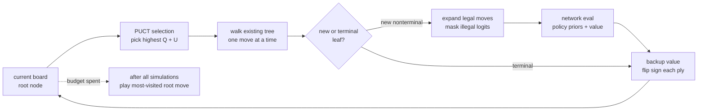
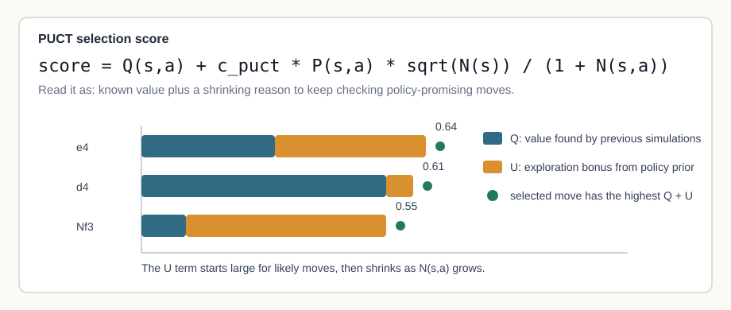
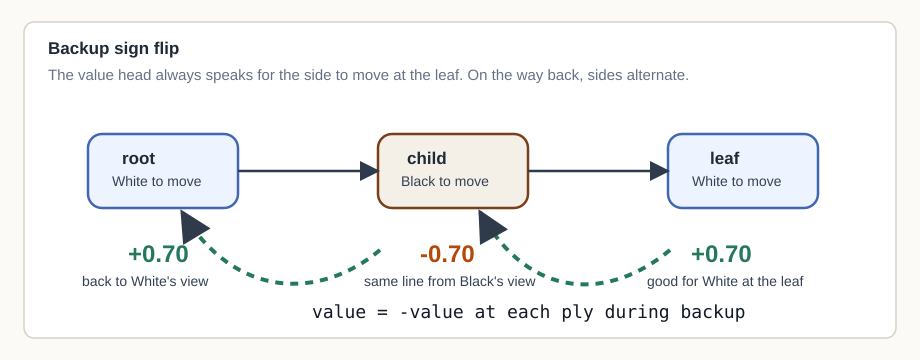

# MCTS And PUCT In McChess

Date: 2026-06-17

## Purpose

This note explains the search that was added for the first MCTS milestone. It
is meant to make the math readable enough that the implementation is easier to
review and debug.

The short version: policy-only play asks the network for one move and commits
to it. MCTS spends a fixed number of extra model calls before moving. PUCT is
the rule that decides where those calls go.

## MCTS Is Not A Fixed Depth

In the current McChess implementation, MCTS uses a simulation budget:

```text
simulations = 50, 300, ...
```

That number is not a depth. A simulation starts at the current board, walks down
the existing tree, expands one new leaf when it finds one, evaluates that leaf,
and backs the value up to the root. After the budget is spent, the bot plays the
root move with the highest visit count.



This is why MCTS can feel different from minimax. Minimax says "look exactly N
plies deep." MCTS says "spend N tries on the lines that look worth checking."
Some lines may get many visits. Others may get one or none.

## The PUCT Score

At each expanded node, search chooses the next edge with:

```text
score(s, a) = Q(s, a) + c_puct * P(s, a) * sqrt(N(s)) / (1 + N(s, a))
```

The terms are:

- `Q(s, a)`: the average value found after taking move `a` from position `s`
- `P(s, a)`: the policy prior from the neural network for that legal move
- `N(s)`: total visits from the parent node
- `N(s, a)`: visits through this move
- `c_puct`: the knob that controls how much the prior keeps pulling search
  toward less-visited moves

In code, `Q` is `edge.value_sum / edge.visit_count`. If an edge has not been
visited yet, its `Q` starts at `0`.

The second term is usually called the exploration bonus. I think of it as a
polite interruption from the policy head:

```text
This move looked plausible before search. Are you sure you checked it enough?
```



The bonus shrinks as `N(s, a)` grows. That matters. A move can get attention
because the policy liked it, but it does not get a free pass forever. Once it
has been searched a lot, it has to stand on its `Q` value.

## Where The Priors Come From

McChess does not let the network invent legal moves. At expansion time:

1. `python-chess` generates legal moves.
2. `legal_policy_mask(board)` marks only those policy indices.
3. Illegal logits are filled with `-inf`.
4. `softmax` turns the remaining logits into priors.

So `P(s, a)` is really:

```text
P(s, a) = softmax(masked_policy_logits)[move_to_index(s, a)]
```

This keeps MCTS inside the same legality contract as the policy-only bot.

## The Value Backup

The value head always predicts from the side-to-move perspective at the leaf.
That convention is useful, but it means backup has to flip sign every ply.

Example:

- leaf says `+0.70`
- that means "good for the side to move at the leaf"
- one ply up, the opponent is to move, so the same line is `-0.70`
- another ply up, it flips back to `+0.70`



This is the part I would not trust without a test. A missing sign flip can make
search prefer lines that are good for the opponent.

## What This Changes In Play

Policy-only play is a single question:

```text
Which legal move has the highest policy logit right now?
```

MCTS asks a slower question:

```text
If I spend more checks on the moves the policy likes, which root move keeps
looking good after the value head sees the replies?
```

That is still not engine supervision. There is no Stockfish, no tablebase, and
no imported best-move label. The search is only using McChess' own policy/value
checkpoint plus legal moves from `python-chess`.

## Local Smoke Result

The first local smoke run used:

- Config: `configs/eval/arena_resnet_b_policy_vs_mcts_50.yaml`
- Agent: `resnet_b_policy_only`
- Opponent: `resnet_b_mcts_50`
- Checkpoint: `runs/lichess_2026_05_2000plus_resnet_b_epoch20_cached_batchmetrics/checkpoint.pt`
- Games: 20
- Max ply: 160
- MCTS budget: 50 simulations, `c_puct = 1.5`
- Result path: `runs/eval/arena_resnet_b_policy_vs_mcts_50.json`

From the policy-only agent perspective:

| Metric | Value |
|---|---:|
| wins | 0 |
| draws | 0 |
| losses | 20 |
| score | 0.000 |
| illegal moves | 0 |
| elapsed seconds | 380.8 |

From the MCTS side, that is 20 wins out of 20 games.

Treat this as a local smoke result for the current working tree. The result JSON
recorded commit `f7cf56b2419cefbef7527bf34761a9ce319546c8`, but the MCTS code
was still uncommitted when the run was made. After this branch is committed, an
archival result should be rerun from the committed code.

## Limitations

This report explains the search and records a first smoke result. It does not
claim Elo or broad playing strength.

The next stronger evaluation should use:

- more games
- a fixed opening suite or saved opening positions
- both colors from each opening
- MCTS budgets such as 25, 50, 100, and 400
- nodes/sec or elapsed time per move

For now, the main result is simpler: MCTS is wired in, it stays legal, and under
the first local ResNet-B policy-only vs MCTS-50 smoke config, search changed the
game outcomes decisively.
